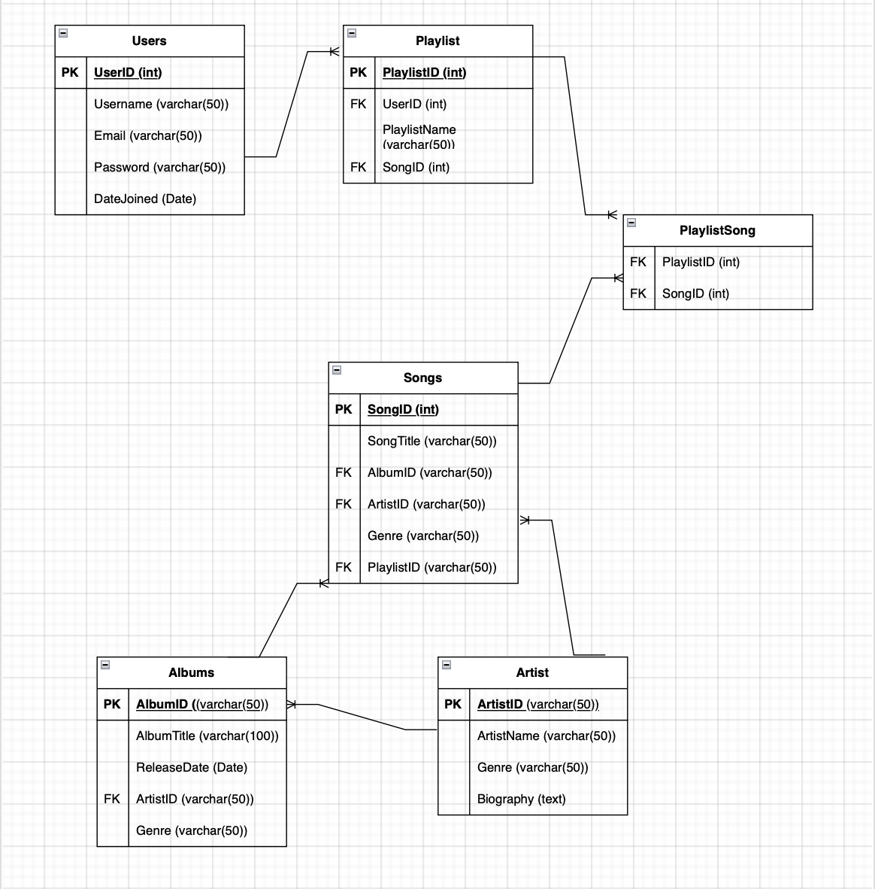

# T2A1-A: Workbook Part A

## Question One
### Describe the architecture of a typical API project, such as Flask application
Within the software industry architecture can be referred to as "the highest-level framework, the skeleton of the software system. It's one of the very first choices made for the bedrock of the system" (Pitaliya, 2021). Before anything is created the architecture of the system should be at the forefront of the project and one of these architecture types is Application Program Interface (API) Architecture.

API Architecture is an ecosystem that is created through utilising the development of software interfaces that utilise the backend data allowing applications functional for use in applications, this is done through four layers; Information Management, Application, Integration, Interaction (What Is API Architecture? | Akana by Perforce, n.d.).
When it comes to an API project, Flask application is the industry standard which is a lightweight Python web framework which allows the user to utilise the application by splitting the major parts into specific directories and files for a more organised application (www.digitalocean.com, n.d.).

Let's take a typical architecture of a HR portal for example; you will need to have main routes for employees that use the portal, this file could be called "routes.py" and inside this file a directory would be made "employees". Within this framework it would be appropriate to create a module called "employees.py" when you would collate the database and have other directories such as; payroll, leave requests, employee information etc and it would start to look something like;

This would be a fairly simple starting point of the blueprint for a structure of utilising flask and allowing API's to migrate between systems.

## Question Two
### Identify a database commonly used in an API project (such as a Flask application) and discuss the pros and cons of this database.
API's and databases are commonly used together to facilitate retrieval, manage and manipulation of stored data by various applications, throughout this application we will be speaking about PostgreSQL

PostgreSQL is described by Richard Peterson (2024) as "an enterprise-class open source database management system. It supports both SQL and JSON for relational and non-relational queries for extensibility and SQL compliance", it is one of the most advanced open source database management systems, which is impressive as it is also one of the oldest.
Each database management system will have advantages and disadvantages; for example with Microsoft SQL Server, they may have Scalability and security as an advantage, but with that the cost and compatibility as a disadvantage. When it comes to PostgreSQL they demonstrate their advantages through being reliable, flexible and scalable(Vojak, 2022).
PostgreSQL demonstrates these advantages respectfully by, being able to handle a large amount of data and being highly stable, supporting a plethora of data types (numeral, text and spacial) as well as being able to support custom data types; and thirdly, by being able to run on a server or even multiple servers through distribution, it is an ideal choice due to it being able to handle a large number of users and process a lot of data (Vojak, 2022).

However it is rare to see something that only has advantages without disadvantages; with PostgreSQL these disadvantages come in the form of complexity and being not so performant. Due to PostgreSQL being highly configurable, it leaves it to be challenging to set up and to maintain as well as it can become slower than some other databases due to its dealing with all the types of data (Vojak, 2022).

Overall among other open-source management system, PostgreSQL is a powerful database to be used in an API project, with 50,734 companies utilising it; Netflix, Instagram, Uber and Skype to name a few (Companies That Use PostgreSQL - PostgreSQL Clients, n.d.).

## Question Three
### Discuss an implementation of an Agile project management methodology for an API project.
The methodology of Agile Project Management is based on managing and delivering projects in an iterative and incremental way which has the benefits of achieving customer and stakeholder alignment, continuous improvement and rapid progress. Agile project is an umbrella term that includes a range of methodologies; Scrum, Kanban, Extreme Programming (XP), and the Adaptive Project Framework (APF) (Wrike, n.d.).

Each one of these methodologies have something different to offer, whether it being the practices, processes or tools. Scrum relates to the fixed length sprint (Drumond, 2024), Kanban is the visual aspect of management with continuous delivery - this would be your trello or dashboards to project stages. Extreme Programming (XP) relates to the technical practices throughout the testing, development and integrations and finally Adaptive Software Development emphasises the adaptation of collaboration, planning and learning from experience (Raeburn, 2022).

The difference between Agile and traditional methodologies is that traditional methods are more rigid with fixed and strict guidelines, this can be known as the waterfall approach where a stage needs to be completed before another stage can be started. Whereas, Agile is more fluid and adaptive as it breaks projects into phases and allows flexibility when it comes to changing requirements (Wrike, n.d.).

Understanding these methodologies first is important before you start the process of implementation amongst your API project. To implement the theoretical frameworks into practice you will need to choose the right Agile framework, assemble your Agile team, plan the project, manage stakeholder expectations and finally measure the success (Wrike, n.d).

## Question Four
### Provide an overview and description of a standard source control process for an API project.
Source control or otherwise known as version control is the way of being able to track and manage changes to ones code; systems such as source control management (SCM) have the ability to provide this history whether it serves for the purpose of code development, revision of code or even when there is a conflict between multiple sources (Amazon Web Services, 2019).

By developers being able to make tweaks, update and have it stored in a server allows a simplistic and straightforward method of managing changes. There are four types of source controls available; Distributed, Centralised, Lock-Based and Optimistic - with the two more populars being Distributed and Centralised being able to store files among multiple repositories or a centralised one(GitLab, n.d.).

Source control processes can standardise an API project by structuring these version controls, and providing stability across developing projects; it can also provide many other advantages and benefits regarding quality, visibility and acceleration.
These advantages can be summarised respectively by encouraging collaboration through frequent peer review leads to improvement in code quality, the ability to review previous source code is able to address issues and minimise downtime providing acceleration in projects and with transparency throughout with a source of truth this give the code visibility and provides project oversight (GitLab, n.d.).

A system that can be used and is industry standard is Git which is open-sourced and is able to be used for any size of project. Having a system in place is one thing, but it's another thing on how to manage it. A few things that are recommended is; committing files with a purpose, writing good and meaningful messages in each commit and making sure every commit is traceable (Schiestl, 2020).

## Question Five
### Provide an overview and description of a standard testing process for an API project.

Testing is an integral part of any process, throughout software it is the practice of testing that validates the performance of a program and how it behaves. The intended purpose of API testing is to reveal bugs and inconsistencies and is important to have continuous testing throughout whether this be done manually or through automated processes. Throughout the testing process there is a focus on performance and functionality, however there is also a need for strong testing for security and documentation testing - these make up the four common types of API testing (www.soapui.org, n.d.).

Where functional testing demonstrates how an API meets the specifies requirements through functions and validation, performance testing assesses the conditions of the API such as; handling high traffic, security testing ensures and identifies and vulnerabilities within the API and lastly API documentation testing provides documentation for whether the APIs hold true when various test have been performed resulting in those developers who consume the API have it documented resulting in correct data (caisy.io, n.d.).
These fundamental testing types can be performed through manual or automated frameworks; manual being able to test for usability and ad-hoc testing; whereas automated testing can be used for dynamic testing, load testing and error testing.

Being able to adopt and adapt API testing is fundamental and is an absolute necessity for continuity of successful software. It leaves no room for ambiguity and complaints when it comes to the functionality, performance, security and documentation.

## Question Six
### Explain the three principles of information system security.

Information system security, or otherwise referred to as InfoSec is the processes and procedural tools designed to protect individual, businesses and organisations information - whether that information being modified, destroyed, disrupted, recorded or inspected.
Information security is becoming increasingly more important than ever due to the vast development of technology in the 21st century. It is critical that certain data such as financial data, customer account details, intellectual property etc are protected as this could lead to consequences of this data being stolen, data tampering or deletion. [ insert reference [
Amongst a business standpoint, this can disrupt and damage a reputation of the business causing tangible costs amongst the owners and investors, on an individual standpoint this data could be used against them with the incidents of identity theft or even blackmail.

Confidentiality, Integrity and Availability are the three structures of what is also known as the CIA Triad (Geveye, 2023). These structures have an ultimate goal in place as a whole, however they have their own individual goals;

- confidentiality has the main goal of encryption of information as well as utilisation of strong password constraints in the means of using different letters, numbers and characters. Two Factor Authentication (2FA) is also a practice that is becoming more and more prevalent these days, where security measures have been put in place where you are needing to sign in and confirm a link or code that has been sent to your mobile or email (Principle of Information System Security, 2020).

- integrity has the main goal of making sure that information is accurate and consistent as well as having the ability to recover any data that was lost due to the violation of the information integrity.
An example that security made simple, 2020 has provided is; "if the CFO sends a document to be examined or reviewed by the director of finance. The director of finance may try to manipulate the information without the CFO knowing in order to make his/her department look better, launder money etc". This reiterates the importance of the controls that businesses and individuals need to have on their information; having secure backups where you are confident you will be able to recover all if not most items; these backups should be routinely done and ongoing.
In addition, user access should also be updated and checked routinely; especially if there has been an attempt at a violation.

- availability; although the last structure in the CIA Triad; it may be one of the first signs of understanding if there is an attempt of an InfoSec risk as this relates to the reliability and accessibility of information - such as a website. In 2024 a SaiPoint blog post echoed this through a quote; "The availability of elements of the CIA triad is often the proverbial canary in the coal mine; if systems have been compromised, availability is usually one of the first indicators of trouble".
Although confidentiality and integrity may seem like the more important concepts of the CIA Triad - what use is it to anyone if it's not accessible.

Overall, protecting information through these principles help mitigate risks and safeguards against both personal and business-related consequences.

## Question Seven
### Provide an overview of what would need to be done within an API project to implement at least one of the principles explained in Question 6.

Previously we had touched upon the principles of information security systems or InfoSec, throughout this we learned that this is made up on Confidentiality, Integrity and Availability - CIA Triad.
Although we did have an overview of what these are, we did not explain how these may be implemented - each of them having different best practices.
Imagine working for a bank or even your own ecommerce store, with the main purpose being able to process financial transactions - your job is to ensure that these systems have the right practices in place so that transactions are accurate and consistent, this is the main goal of the integrity principle.

In 2024, Cambridge Dictionary defined integrity as, "the quality of being honest and having strong moral principles that you refuse to change", however in this context a more appropriate definition would be; "the property that sensitive data has not been modified or deleted in an unauthorised and undetected manner since it was created, transmitted or stored" (Barker & Barker, 2019).

There are many ways for a business to implement this principle into their systems, one being utilising secure backup systems as we have already mentioned - another being "Hashing" and Secure Password Hashing.
This concept of hashing is a fixed-length alphanumeric value - it is a fingerprint for your data essentially, with each change with the data the value will change. This can be very useful when applying this to stored passwords as it adds random data which makes it more difficult for an attacker to crack a password's hash (Stickney, 2021).

To implement this code into your system; first use a strong hashing algorithm that is designed for password storage (e.ge., bcrypt, Argon2, haslib etc). In addition, you can also add in something called "Salt", by salting your password before hashing as this will ensure that passwords that are identical have a unique hash (Stickney, 2021).

In this example we will use bcrypt as our import to initialise the hashing:

An example by geeksforgeeks(2022) provided a simple code to get us started.
______________________

import bcrypt
##### Declaring our password
password = b'GeekPassword'
##### Adding the salt to password
salt = bcrypt.gensalt()
##### Hashing the password
hashed = bcrypt.hashpw(password, salt)
##### printing the salt
print("Salt :")
print(salt)
##### printing the hashed
print("Hashed")
print(hashed)

______________________

## Question Eight
### Explain the legal obligations that developers of a social media website or social media application would have in regards to handling user data, with reference to any applicable laws or acts.

In every industry there is a legal obligation and being a developer of a social media website or media application is no exemption. These legal obligations are influenced by a variety of needs to protect user privacy and ensure data security - both on a national and an international scale.

In Australia specifically, we have many acts and legal obligations that need to be abided by - these primarily are based from the Privacy Act 1988. It is the Office of the Australian Information Commissioner (OAIC) that defines the act; "The Privacy Act 1988 was introduced to promote and protect the privacy of individuals and to regulate how Australian Government agencies and organisations with an annual turnover of more than $3 million, and some other organisations, handle personal information" (n.d.).

This legislative act is to set out right's for people in regards to the collection, use and sharing of personal information and is done so through 13 Australian Privacy Principles (APPS). APPS are to govern the rights, obligations and standards pertaining to an organisation or agency's governance and accountability through to the rights of individuals to access their own personal information.

The 13 Australian Principles are;
- 1. Open and transparent management of personal information
- 2. Anonymity and pseudonymity
- 3. Collection of solicited personal information
- 4. Dealing with unsolicited personal information
- 5. Notification of the collection of personal information
- 6. Use or disclosure of personal information
- 7. Direct marketing
- 8. Cross-border disclosure of personal information
- 9. Adoption, use or disclosure of government related identifiers
- 10. Quality of personal information
- 11. Security of personal information
- 12. Access to personal information
- 13. Correction of personal information
Provided by Office of the Australian Information Commissioner (OAIC, 2023)

Within the software developer industry the Privacy Act 1988 is highly relevant when it comes to handling user data, specifically for developers of social media websites. When it comes to APP 1, this reflects the kinds of information that is collected, held and used - whether that being names, emails and location data(OAIC, 2023) and as a social media platform this must have a comprehensive privacy policy in place, generally this will be accessed easily through a link on a website, or app settings.

Another critical APP to mention for software media platforms is APP 11, this relates to the requirement of personal information to be protected from being misused or interfered with (OAIC, 2019). It is important that the software media platforms create strong and well rounded encryption protocols for data.

These are only the legal obligations that pertain to Australia, with a plethora of other legal obligations throughout as well as international laws.

## Question Nine
### Describe the structural aspects of the relational database model. Your description should include information about the structure in which data is stored and how relations are represented in that structure.

Throughout almost all web and apps, there will be data that needs to be managed and this can be done through relational databases which helps with structuring the stored data and creating linked relationships between different datasets. Think of this as if you were at a grocery store, you have aisles and those aisles have sections and those sections have different items - this is how the relational database is structured through data management (Mastering Relational Database Structure, 2024).

When we look into the structure of relational databases, it comes* down to how the organisation of this data is structured and whether it is logical; these structures should be organised through tables, keys and relationships (Mastering Relational Database Structure, 2024). In our example of a grocery store, the table would act as the grocery store and be a distinct entity, with the ability to categorise specific information, the keys would play the role of distinguishing aisles in this instance, there are primary and foreign keys. Primary keys identify each aisle in the grocery store whereas foreign keys demonstrate the relationships between the different aisles.

Relationships between tables and datasets can be navigated in various ways, these would be; one-to-one, one-to-many and many-to-many relationships. Respectfully, these relationships establish links directly, a single record in one table linked to many multiple records in another table and multiple records from one table to multiple records in another table.
For example; one-to-one relationships would be the product at the grocery store with the detailed specification of that product, one-to-many establishes a relationship through the category of the product, each category can include multiple products and finally customer orders have a many-to-many relationship with products, each order can include multiple products, each product can be part of multiple orders.

Relational databases are used to hone in on the flexibility and ability to manage data through the relationship between tables and primary and foreign keys, it allows data to become more structured with keeping the integrity of the data.

## Question Ten
### Describe the integrity aspects of the relational database model. Your description should include information about the types of data integrity and how they can be enforced in a relational database.
Overtime data can become complex and messy, it is important that this data maintains accuracy, consistency and most importantly the integrity of the data. Integrity of the relational database model is to implement measures to prevent loss, corruption or unauthorised access to information, this can be done through two different types of data integrity; physical and logical (Yackel, 2023).

It has been mentioned that protecting data to maintain its accuracy is important, however it is also important to note this also means the physical integrity of the data - whether that is physical files or data storage. Physical integrity involves the aim to protect the data from being compromised by power outages and natural disasters. Where physical data is the tangible data, logical integrity can be defined by the protection from hacking or even human error; this concept comes in four main different formats; Entity, Referential, Domain and User-Defined (Fortinet, n.d.).

Although all four of these main formats are important, it is prevalent that Entity Integrity is considered the most fundamental and is the backbone of relational database model and its integrity. By having uniquely identifiable rows within a table, you have entity integrity, which also ensures that entity integrity has accurate data retrieval, data consistency and efficient relationship whilst still maintaining the uniqueness and non-nullability values (Naeem, 2020).

The concept of entity integrity relates to any person, place, or thing that needs to be recorded in a database.
If we were to use the grocery store example from question 9, the code to execute entity integrity would be something like this;

CREATE TABLE Products (
  ProductID INT PRIMARY KEY,  -- Primary Key column for unique product identification
  ProductName VARCHAR(100) NOT NULL,  -- Product name must be provided
  Price DECIMAL(10, 2) NOT NULL,  -- Price must be provided and must be a valid decimal
  StockQuantity INT NOT NULL,  -- Stock quantity must be provided
  Category VARCHAR(50)  -- Optional category for the product
);

We would have the ability to SELECT, ALTER, UPDATE, DELETE and INSERT data throughout to maintain the accuracy and integrity of the data.

## Question Eleven
### Describe the manipulative aspects of the relational database model. Your description should include information about the ways in which data is manipulated (added, removed, changed, and retrieved) in a relational database.

In our previous question we touched upon the ability to SELECT, UPDATE, DELETE AND INSERT - these are the four types of manipulative aspects of the Data Manipulation Language (DML) used for retrieving, updating, removing and inserting data (Naeem, 2020).

Here is a detail explanation of each variant of DML:

SELECT
The ability to retrieve data and manage data is one of the reasons why databases exist, it allows us to select the information that we need and view, this is done by using a "SELECT" statement (Naeem, 2020).

An example of this would be;

SELECT product_name, price
FROM Products
WHERE category = 'Fruit';

This retrieves the data from the "products" table and returns a result that includes the names and prices of the category that is "fruit".

UPDATE
To be able to modify existing records is a powerful tool, and this can be done through the "UPDATE "statement, it enables the user to update records individually or collectively (Naeem, 2020)..

An example of this would be;

UPDATE Products
SET price = 0.65
WHERE product_name = 'Bananas';

In this example we have used the UPDATE statement to modify the cost of bananas to 1.65.

DELETE
We can illustrate removing records from a relational database by using the "DELETE" function, this allows us to manage unnecessary or even obsolete entries.

An example of this would be;

DELETE FROM Products
WHERE product_name = 'Bananas';

This specifies that we are wanting to remove "Bananas" from the "Products" table.

INSERT
To be able to add new records to tables is done through the "INSERT" statement and allows you to insert data in a specified column.

An example of this would be;

INSERT INTO Products (product_id, product_name, category, price, stock_quantity)
VALUES (6, 'Strawberries', 'Fruit', 1.20, 50);

This would be adding product 6, which is Strawberries that is categorised as Fruit for the price at 1.20 with 50 stock quantities.

By being able to understand these essential data manipulation operations it allows you to master the ability of managing and maintaining data efficiently.

## Question Twelve
### Conduct research into a web application (app) and answer each of the following sub-questions:
One of my favourite joys in life is music, with my top artists of the year usually being Doja Cat, Billie Eislish and Hilary Duff - so for this example we will be using Spotify as our example. Spotify is a music streaming web app that was made in 2006 and has been consumed by billions of users worldwide, this is because of the ease and the aesthetics of the user interface and how it responds - it is a powerhouse when it comes to music streaming.

#### List and describe the software (tech stack) used by the app.

Within Spotify, the tech stack used by the app is made up of 77 different tools and technologies; this ranges from the languages and frameworks, development tools, libraries, application hosting, application utilities, analytics and more (Spotify Tech Stack, n.d.). Throughout this we will be highlighting many of these concepts throughout the front-end and back-end tech stack as well as highlighting other technologies used.

As the names of front-end and back-end suggest, this pertains to the front end programming languages to create what the user sees in the browser, whereas the back end is to fulfil those requests on the server - combining both of these things is what is responsible for a seamless user experience on the internet (Gallinelli, 2021).
When we talk about front-end, we are talking about the visual aspects of what the user sees and how it responds; this could be the text, background, icons, interactions with the mouse like an animation that hovers or changes colours.

These are the main Spotify front-end tech stack and how it is utilised.
- Javascript
- React (Javascript Library)
- Redux (State management Library)

With the utilisation of the main three systems, it allows Spotify to build a comprehensive, dynamic and responsive user interface; with the primary use of Javascript it swiftly reacts to user inputs and integrates seamlessly with third-party services and APIs. React is used to create components that allow web and mobile applications to be intricate, interactive and enhanced - it has the ability to build with Javascript due to it being a Javascript library developed by Facebook (Wallis, 2023).
Lastly, to handle complex elements like user authentication and music playback, Spotify utilises Redux as their state management system, to centralise the applications state and to offer a robust debugging tool (Wallis, 2023).

When we talk about back-end, we are talking about the aspects that the user can not see but is what creates the user experience with a browser. The back-end is the brain behind the front and creates the logic, data and analytics (Gallinelli, 2021) and is done so by using these logics when a user requests information by either selecting, inputting and utilising the data of the browser .

These are the main Spotify back-end tech stack and how it is utilised.
- Java
- Apache Cassandra
- Apache Kafta

Spotify combines powerful technologies in its back-emd to ensure scalability, reliability and efficiency, with the use of Java as their primary utility it employs a robustness to its platform allowing ease when handling extensive data processing (Wallis, 2023). Amongst the infrastructure for the backend, Apache Cassandra and Kafta is utilised respectively for managing large volumes to distribute data and facilitates real time data streaming, both crucial when it comes to ensuring high availability and delivering user experience (Wallis, 2023).

This tech stack highlights the technologies Spotify uses to deliver a high-performance, scalable, and user-friendly music streaming experience across various platforms. It is important to note that these are only 6 of the 77 tech stacks involved with Spotify; with all 71 others playing their own role with building this robust music streaming app. Other technologies and tech stacks that are involved with creating this app is the utilisation of cloud services like Amazon Web Services (AWS) and Google Cloud Platform (GCP), Web API to provide RESTful endpoints and machine learning to provide insight of the spotify user by utilising algorithms (Wallis, 2023).

#### Describe or make educated guesses about the hardware used to host the app.

Every mobile application runs on databases and Spotify is no exception. These databases are there to conduct data and have the ability to aggregate, analyse and manipulate the data. With Spotify having over 626 million users (Spotify — about Spotify, n.d.) these databases need storage and connectivity, which is where hosting of the data comes in.

Hosting demonstrates how storage space can be provisioned amongst websites, applications or databases on servers. This hosting can be managed among physical or virtual servers and are responsible for running applications, storing data and managing network traffic, these hosting servers can be found on-premises, on cloud platforms or even a combination of both. (Spotify Engineering, 2016).

With Spotify, it can be speculated that the way they would host their data is through cloud hosting with possible data centres being used for the load of data that would be taken in as Spotify would need to ensure a high performance and reliability. Spotify can achieve both of these due to the utilisation of Amazon Web Services (AWS) one report shows (Spotify Engineering, 2016).
In addition; of hosting hardware that would be used it is an educated guess that data centres would also be utilised due to the nature of this technology as well as in comparison to other competitors within the industry.

#### Describe the interaction of technologies within the app.

Spotify integrates a variety of technologies to deliver its services, this can be demonstrated through the last few questions. The interaction within Spotify is no different to a lot of different apps, the front-end technologies that utilise languages like HTML, CSS and Javascript, communication with the backend utilising API's that utilise Java or Python, which in turn interact with databases, cloud and other hosting infrastructures.
With the utilisation of these tools, it allows the technologies that interact within Spotify a smooth, high-quality music streaming experience to millions of users (626 million to be exact).

#### Describe the way data is structured within the app’s database(s).

Facilitating efficient storage, retrieval and management of vase amounts of information is essential to Spotify and how they manage the data effectively for user, music content, playlists etc. Spotify uses a structure that is designed to handle various use cases and employs a combination of relational databases; PostgreSQL, Cassandra and NoSQL.

#### Identify the entities/tables that are tracked within the app’s database(s).

In Spotify’s app, various entities are tracked and managed within the database(s) to support its functionality. These entities represent the core data elements that the app interacts with. Here’s a list of the basic entities/tables typically tracked within Spotify’s database(s):

1. User
Table Name: Users
Description: Stores information about each user of the app.

Key Attributes:
UserID (PK): Unique identifier for the user.
Username: User’s display name.
Email: User’s email address.
Password: User's Password

2. Playlist
Table Name: Playlists
Description: Contains details about playlists created by users.

Key Attributes:
PlaylistID (PK): Unique identifier for the playlist.
PlaylistName: Name of the playlist.
UserID (FK): References the user who created the playlist.

3. Song
Table Name: Songs
Description: Holds metadata for individual songs.

Key Attributes:
SongID (PK): Unique identifier for the song.
SongTitle: Title of the song.
AlbumID (FK): References the album the song belongs to.
ArtistID (FK): References the artist who performed the song.
Genre: Genre of the song.

4. Artist
Table Name: Artists
Description: Contains information about artists who create music.

Key Attributes:
ArtistID (PK): Unique identifier for the artist.
ArtistName: Name of the artist.
Genre: Genre associated with the artist.
Biography: Brief biography or description of the artist.

5. Album
Table Name: Albums
Description: Stores details about music albums.

Key Attributes:
AlbumID (PK): Unique identifier for the album.
AlbumTitle: Title of the album.
ReleaseDate: Date when the album was released.
ArtistID (FK): References the artist who released the album.
Genre: Genre of the album.

6. Playlist-Song Relationship
Table Name: PlaylistSongs
Description: Manages the many-to-many relationship between playlists and songs.

Key Attributes:
PlaylistID (FK): References the playlist.
SongID (FK): References the song.

#### Identify the relationships and associations between the entities/tables identified in sub-question E.

Based on the relationships of the entities; this can be defined by one-to-one, one-to-many, many-to-many and many-to-one.
These relationships between the users, playlists, songs, artists, albums would be demonstrated as the following;
Users are linked to Playlists (one-to-many), these Playlists are connected to Songs (many-to-many), these songs are associated with artists and albums (many-to-one) and finally Albums are associated with Songs (one-to-many).

These relationship associations can be demonstrated using an Entity Relationship Diagram or an ERD, this provides the viewer a visual representation of the relationships between each entity.

#### Design an entity relationship diagram (ERD) based on the answers provided to sub-questions E and F. This must represent a relational database model, even if the app itself uses something other than a relational database model.

Primary Keys (PK) are unique identifiers for each entity
Foreign Keys (FK) establish relationships between entities

User to Playlist
- A User can create many Playlists, each Playlist is created by One User
- Relationship One-to-Many (User to Playlist)

Playlist to PlaylistSong
- A Playlist can have many Songs through the PlaylistSong table
- Relationship One-to-Many (Playlist to PlaylistSong)

Song to PlaylistSong
- A Song can appear in many Playlists through the PlaylistSong table
- Relationship One-to-Many (Song to PlaylistSong)

Song to Album
- A song belongs to one Album
- Relationship Many-to-One (Song to Album)

Album to Artist
- An Album is create be one Artist
- Relationship Many-to-One

Song to Artist
- A Song is performed by one Artist
- Relationship Many to One

#### PlaylistSong:
The PlaylistSong table manages the relationship between Playlist and Song.

## Bibliography / References

Pitaliya, S. (2021, May 27). Understanding Software Architecture: A Complete Guide. Medium. https://sarrahpitaliya.medium.com/understanding-software-architecture-a-complete-guide-cb8f05900603

What Is API Architecture? | Akana by Perforce. (n.d.). Akana. https://www.akana.com/blog/api-architecture

www.digitalocean.com. (n.d.). How To Structure a Large Flask Application with Flask Blueprints and Flask-SQLAlchemy | DigitalOcean. [online] Available at: https://www.digitalocean.com/community/tutorials/how-to-structure-a-large-flask-application-with-flask-blueprints-and-flask-sqlalchemy.

Peterson, R. (2024, March 24). What is PostgreSQL? Introduction, History, Features, Advantages. Guru99.com. https://www.guru99.com/introduction-postgresql.html

Vojak, J. (2022, December 22). Exploring the pros and cons of SQL databases — MySQL, Postgres, Oracle, Microsoft SQL, and Amazon…. Medium. https://josipvojak.com/exploring-the-pros-and-cons-of-sql-databases-mysql-postgres-oracle-microsoft-sql-and-amazon-3c8de880b8d4

Wrike. (n.d.). What is Agile Methodology in Project Management? Wrike. https://www.wrike.com/project-management-guide/faq/what-is-agile-methodology-in-project-management/

Drumond, C. (2024). What is scrum and how to get started. Atlassian. https://www.atlassian.com/agile/scrum

Raeburn, A. (2022, November 28). What is Extreme Programming (XP)? Asana. https://asana.com/resources/extreme-programming-xp

Companies That Use PostgreSQL - PostgreSQL Clients. (n.d.). Thomson Data. Retrieved August 2, 2024, from https://www.thomsondata.com/customer-base/companies-that-use-postgresql.php#:~:text=Companies%20using%20PostgreSQL%20mostly%20do

What is Source Control? - Amazon Web Services. (2019). Amazon Web Services, Inc. https://aws.amazon.com/devops/source-control/

GitLab. (n.d.). What is version control? GitLab. https://about.gitlab.com/topics/version-control/

Schiestl, B. (2020, May 21). 8 Version Control Best Practices. Perforce Software. https://www.perforce.com/blog/vcs/8-version-control-best-practices

www.soapui.org. (n.d.). API Testing And How to Do It | SoapUI. [online] Available at: https://www.soapui.org/learn/functional-testing/api-testing-101/.

API Testing: A Comprehensive Guide for Developers | caisy. (n.d.). Caisy.io. https://caisy.io/blog/api-testing-for-developers

securitymadesimple. (2020, December 24). What are the 3 principles of Information Security? SecurityMadeSimple.org. https://securitymadesimple.org/cybersecurity-blog/what-are-the-3-principles-of-information-security/

CIA triad: Confidentiality, integrity, and availability. (n.d.). SailPoint. https://www.sailpoint.com/identity-library/cia-triad/

Principle of Information System Security. (2020, January 15). GeeksforGeeks. https://www.geeksforgeeks.org/principle-of-information-system-security/

Geveye, M. O. (2023, November 2). Understanding the Core Principles of Information Security. Centraleyes. https://www.centraleyes.com/core-principles-of-information-security/

Cambridge Dictionary. (2024). INTEGRITY | Meaning in the Cambridge English Dictionary. Cambridge.org. https://dictionary.cambridge.org/dictionary/english/integrity

Barker, E., & Barker, W. (2019, May 23). Recommendation for Key Management: Part 2 – Best Practices for Key Management Organizations. Csrc.nist.gov. https://csrc.nist.gov/pubs/sp/800/57/pt2/r1/final

Stickney, J. (2021, July 18). Hashing & Integrity — The “I” in the CIA Triad. Medium. https://jacob-e-stickney.medium.com/hashing-integrity-the-i-in-the-cia-triad-98b722b6fe39

https://www.geeksforgeeks.org/how-to-hash-passwords-in-python/

Office of the Australian Information Commissioner. (n.d.). The Privacy Act. OAIC; Australian Government. https://www.oaic.gov.au/privacy/privacy-legislation/the-privacy-act

Office of the Australian Information Commissioner. (2023, March 10). Rights and responsibilities. OAIC. https://www.oaic.gov.au/privacy/privacy-legislation/the-privacy-act/rights-and-responsibilities

OAIC. (2023, March 10). Chapter 1: APP 1 Open and transparent management of personal information. OAIC. https://www.oaic.gov.au/privacy/australian-privacy-principles/australian-privacy-principles-guidelines/chapter-1-app-1-open-and-transparent-management-of-personal-information

https://www.oaic.gov.au/privacy/privacy-legislation/the-privacy-act/rights-and-responsibilities

Mastering Relational Database Structure. (2024, April 9). Myscale.com. https://myscale.com/blog/essential-components-relational-database-structure/

Yackel, R. (2023, June 22). 12 Data Integrity Examples: Types, Industry Usage, and Risks. IBM Blog. https://www.ibm.com/blog/data-integrity-examples/

Fortinet. (n.d.). What Is Data Integrity? Types, Risks and How to Ensure. Fortinet. https://www.fortinet.com/resources/cyberglossary/data-integrity

Naeem, T. (2020, February 12). Data Integrity in a Database - Why Is It Important. Astera. https://www.astera.com/type/blog/data-integrity-in-a-database/

Naeem, T. (2020, March 12). Data Manipulation Tools - Understanding the Basics. Astera. https://www.astera.com/type/blog/data-manipulation-tools/

Spotify Tech Stack. (n.d.). Himalayas. https://himalayas.app/companies/spotify/tech-stack

Gallinelli, N. (2021, January 13). Front End vs. Back End Development. Flatiron School. https://flatironschool.com/blog/front-end-vs-back-end-development/

Spotify — About Spotify. (n.d.). Spotify. https://newsroom.spotify.com/company-info/#:~:text=We%20are%20the%20world%27s%20most

Engineering, S. (2016, March 25). Managing Machines at Spotify. Spotify Engineering. https://engineering.atspotify.com/2016/03/managing-machines-at-spotify/

Wallis, J. (2023, March 1). How Does Spotify Work? Spotify Tech Stack Explored. Intuji. https://intuji.com/how-does-spotify-work-tech-stack-explored/

